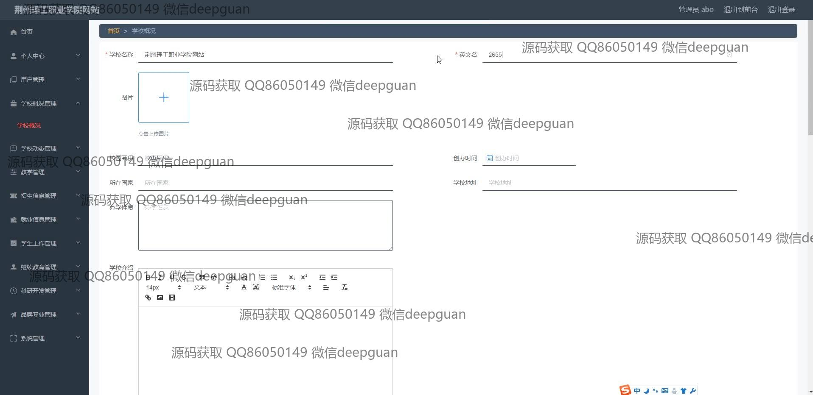

<h1 align="center">荆州理工职业学院网站+vue</h1>

## 简介
荆州理工职业学院网站：包括用户管理、学校校况、教学管理、招生信息、就业信息、科研开发、继续教育、品牌专业和学生工作管理等功能模块，支持信息发布与编辑、搜索与分类浏览、文件上传及文本编辑功能。    --计算机毕业设计源码；毕设源码；java毕业设计源码

## 联系方式

<h3 align="center">获取完整代码与数据库文件 + 微信：deepguan QQ: 86050149 QQ群: 783742310</h3>

<h3 align="center">可帮忙远程部署 包运行成功！提供远程部署、修改代码、设计文档指导、代码讲解等服务！</h3>

## 功能介绍（完整见运行截图）
管理员：基本功能包括用户登录、注册和退出，提供对网站的全面管理。导航菜单支持管理用户信息、学校概况、教学管理、招生信息、就业信息、学生工作、继续教育、科研开发和品牌专业等功能模块。可以编辑和发布动态信息、校况、招聘会、就业信息及科研新闻，使用富文本编辑各类发布内容，上传封面图片和设置发布时间。主要页面包括用户管理、学校动态、学校信息管理、教学管理和就业信息管理。

用户：可以通过简洁的注册界面创建账号，并通过登录访问网站各功能模块。网站首页包括导航栏，提供对学校概况、教学管理、学校动态、就业信息、继续教育等模块的便捷访问。用户能查看学校的科研新闻及动态内容，使用分页和搜索功能查找信息。网站支持用户查看和浏览详细的就业信息、学校规划，并可调整文字格式以便于阅读不同内容。

学生：可以通过管理模块访问学校动态、就业信息等内容，了解校园及学术活动。访问毕业设计管理系统，查看就业信息、继续教育及科研开发内容。可以通过富文本编辑器查看详细信息或上传相关学术资料，通过分页和搜索功能找到所需文档和活动，参与学校的动态和继续教育板块。支持使用导航栏快速定位到需要的信息。

教师：通过管理界面编辑和发布相关教学内容及动态信息。可以在学校概况、教学管理和科研开发模块中发布教学材料、课程信息和科研新闻。编辑功能允许上传封面图片及使用富文本编辑器调整文本内容和格式，发布的内容可以被关联到具体类别，如科研信息类型或教学通知，提供详细的学术和教学活动信息，便于授课和管理教学资源。

## 运行截图

本代码来源于网络,仅供学习参考使用!

